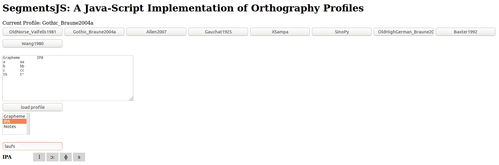

# Supplementary Material

## 1 Scripts for pre- and post-processing

The following instructions are best tested by typing them in your terminal from this text. However, for reasons of convenience, we also provide a Makefile that abbreviates the commands for you. Thus, if you want to install the software, provided you have GIT and Python3 installed, and work in a Unix enviroment (with a typical Shell), you can also type:

```
make install
```

### 1.1 Installing the library

Assuming that users have `git` and Python (version 3) installed, it is straightforward to optain the `worforpy` library and use it.

```
$ git clone https://github.com/digling/word-formation-paper.git
$ cd word-formation-paper
$ python setup.py develop
```

Depending on the system, users may need super-user-rights. To avoid this, we recommend to use a virtual environment.

Once installed, the library can be called from the commandline, by typing 

```
$ worforpy help
USAGE: worforpy COMMAND
```

### 1.2 Generate annotations

The small library includes options to create certain steps of the annotation workflow semi-automatically.

#### 1.2.1 Generate IPA with the help of an orthography profile

Linguistic data can be turned into IPA effortlessly with the help of orthography profiles [@Moran2018], i.e. a replacement table. Access to the orthography profiles used for the Germanic data described in section 2.2 below can be gained via https://digling.org/calc/profile/. All orthography profiles we used are also included in the supplementary material. To use this interface, click on the profile of your choice (e.g. `Gothic_Braune2004a`), select "IPA", and type a word you want to transform from Gothic standardized orthography into IPA. This for example turns *laufs* into /lɔːɸs/:



Alternatively, you can also paste your own custom orthography profiles into the upper box and click on "load profile".

#### 1.2.2 Add morpheme boundaries automatically

Adding each morpheme boundary manually, or even with search and replace, can be tedious. Instead, our library includes the option to provide a list of morphemes that shall be segmented off, and automatically adds morpheme boundaries for them if you type:

```
$ worforpy split-from-list WORDLIST MORPHEMELIST
```

WORDLIST and MORPHEMELIST thereby point to the names of your input files. The first is a typical wordlist, as described in detail in the paper, the second is a simple TSV-file with two columns, the first providing the morpheme in segmented form, and the second the proposed gloss. We include simple example files with German data in the folder TestDatasets. To indicate if a boundary occurs at the end or the beginning of a word form, you can mark boundaries with `^`, indicating that the boundary appears at the beginning, and `$`, indicating it appears at the end. 

The code will split the entries in the column `TOKENS` in your wordlist and add a column `MORPHEMES`.

#### 1.2.3 Generate initial glosses for morpheme-segmented wordlists

Glosses for the segmented morphemes can be generated automatically based on the elicitation glosses by using the aformentioned script, but this time providing an empty file with glosses. 

### 1.3 Check annotations

The library also offers several ways to check a given annotation. The basic idea here is to test that the values submitted across the different columns in a given wordlist are consistent. The morpheme glosses, for example, should have the same length as the cross-semantic cognate identifiers, and the morpheme-segmented transcriptions should have the same length as well, in the sense of containing the same amount of morphemes or values per field in a given row.

#### 1.3.1 Check the length across columns

To get started, we test for the length of the values in the major columns of our annotations. In order to do so, we simply type:

```
$ worforpy check-length AnnotatedDatasets/Burmish.tsv tokens crossids morphemes
```

This will yield nothing as output, as there are no errors in the data with respect to this point.

#### 1.3.2 Check strict cognacy

To check strict cognacy, we check for each language internally, if all words parts annotated as strict cognates are indeed identical. To trigger this test, we now type:

```
$ worforpy check-strict-cognacy AnnotatedDatasets/Burmish.tsv
```

Here the script will find erroneously annotated cognates, as shown in the output:

```
# Atsi / meat
|   idx | token   | tokens            |
|------:|:--------|:------------------|
|  2065 | ʃ ŏ ²¹  | ʃ ŏ ²¹ + p i k ²¹ |
|  2535 | ʃ o ²¹  | ʃ o ²¹            |
|  4223 | ʃ ŏ ²¹  | ʃ ŏ ²¹ + m j i ²¹ |

# Bola / meat
|   idx | token   | tokens            |
|------:|:--------|:------------------|
|  4226 | ʃ ă ³⁵  | ʃ ă ³⁵ + m i ³¹   |
|  2066 | ʃ ă ³⁵  | ʃ ă ³⁵ + p a k ³¹ |
|  2536 | ʃ a ³⁵  | ʃ a ³⁵            |
|   487 | ʃ ă ³⁵  | ʃ ă ³⁵ + u ³¹     |

# Lashi / meat
|   idx | token   | tokens            |
|------:|:--------|:------------------|
|  2068 | ʃ o ⁵⁵  | ʃ o ⁵⁵ + p əː ³¹  |
|  4231 | ʃ ŏ ⁵⁵  | ʃ ŏ ⁵⁵ + m j i ³³ |
|  2537 | ʃ o ⁵⁵  | ʃ o ⁵⁵            |
|   490 | ʃ ŏ ⁵⁵  | ʃ ŏ ⁵⁵ + j ou ³³  |

# Maru / meat
|   idx | token   | tokens            |
|------:|:--------|:------------------|
|  4234 | ʃ ɔ̆ ³⁵  | ʃ ɔ̆ ³⁵ + m j i ³¹ |
|  2069 | ʃ ɔ̆ ³⁵  | ʃ ɔ̆ ³⁵ + p a k ³¹ |
|   493 | ʃ ŏ ³⁵  | ʃ ŏ ³⁵ + ɣ u k ⁵⁵ |
|  2538 | ʃ ɔ ³⁵  | ʃ ɔ ³⁵            |
```

As can be seen, the languages in the sample show words that are given the same morpheme gloss, but which are no strict cognates, as we have an opposition between long and ultra-short vowels in all cases. For the Burmish languages, this is a clear case of allomorphy, due to compounding, as can also seen from these four examples. A way to avoid the problem, one can annotate the data with help of the `source/target` construct, by which the original value is retained before the slash `/` and the "deep" value, i.e., the abstraction imposed by the linguist, is written behind it `[`ʃ ă/a ³⁵ + u ³¹`]`. 

#### 1.3.3 Check root cognates and normal cognates

One root cognate can correspond to several strict cognates, but one strict cognate can never correspond to several root cognates. This is checked by typing:

```
$ worforpy check-rootids AnnotatedDatasets/Germanic.tsv
```

### 1.4 Analyze anotations

After the annotations are ready and checked for consistency, the library can also be used for basic analyzing of the data.

#### 1.4.1 Overview on word families

In order to get a better overview on the annotated data, a summary of all word families, i.e. all words across all languages in the dataset sharing a cognate morpheme, can be displayed by typing:

```
$ worforpy word-families AnnotatedDatasets/Polynesian.tsv
```
which, for this very small dataset, leads to the output:

```

# ROOT 1
|   ID | Doculect       | Concept   | RootForm    | RootConcept   | Tokens                | Morphemes   |
|-----:|:---------------|:----------|:------------|:--------------|:----------------------|:------------|
| 3802 | EastFutuna_210 | wife      | m a t u ʔ a | old           | f i n e + m a t u ʔ a | woman old   |
| 3646 | EastFutuna_210 | old       | m a t u ʔ a | old           | m a t u ʔ a           | old         |

# ROOT 2
|   ID | Doculect       | Concept      | RootForm   | RootConcept   | Tokens                | Morphemes   |
|-----:|:---------------|:-------------|:-----------|:--------------|:----------------------|:------------|
| 3806 | EastFutuna_210 | woman/female | f i n e    | woman         | f i n e               | woman       |
| 3802 | EastFutuna_210 | wife         | f i n e    | woman         | f i n e + m a t u ʔ a | woman old   |

# ROOT 3
|   ID | Doculect      | Concept          | RootForm   | RootConcept   | Tokens            | Morphemes   |
|-----:|:--------------|:-----------------|:-----------|:--------------|:------------------|:------------|
|  357 | Wallisian_258 | earth/soil       | k e l e    | earth         | k e l e           | earth       |
|  373 | Wallisian_258 | worm (earthworm) | k e l e    | earth         | ʔ u l u + k e l e | head earth  |

# ROOT 4
|   ID | Doculect      | Concept          | RootForm   | RootConcept   | Tokens            | Morphemes   |
|-----:|:--------------|:-----------------|:-----------|:--------------|:------------------|:------------|
|  480 | Wallisian_258 | head             | ʔ u l u    | head          | ʔ u l u           | head        |
|  373 | Wallisian_258 | worm (earthworm) | ʔ u l u    | head          | ʔ u l u + k e l e | head earth  |

# ROOT 5
|   ID | Doculect   | Concept   | RootForm   | RootConcept   | Tokens          | Morphemes   |
|-----:|:-----------|:----------|:-----------|:--------------|:----------------|:------------|
|  826 | Maori_85   | fruit     | h u a      | fruit         | h u a           | fruit       |
|  845 | Maori_85   | egg       | h u a      | fruit         | h u a + m a n u | fruit bird  |

# ROOT 6
|   ID | Doculect   | Concept   | RootForm   | RootConcept   | Tokens          | Morphemes   |
|-----:|:-----------|:----------|:-----------|:--------------|:----------------|:------------|
|  845 | Maori_85   | egg       | m a n u    | bird          | h u a + m a n u | fruit bird  |
|  847 | Maori_85   | bird      | m a n u    | bird          | m a n u         | bird        |

# ROOT 7
|   ID | Doculect     | Concept   | RootForm   | RootConcept   | Tokens            | Morphemes    |
|-----:|:-------------|:----------|:-----------|:--------------|:------------------|:-------------|
| 3130 | Sikaiana_243 | small     | l i k i    | small         | l i k i           | small        |
| 3231 | Sikaiana_243 | child     | l i k i    | small         | t a m a + l i k i | person small |

# ROOT 8
|   ID | Doculect     | Concept            | RootForm   | RootConcept   | Tokens            | Morphemes    |
|-----:|:-------------|:-------------------|:-----------|:--------------|:------------------|:-------------|
| 3236 | Sikaiana_243 | person/human being | t a m a    | person        | t a m a           | person       |
| 3231 | Sikaiana_243 | child              | t a m a    | person        | t a m a + l i k i | person small |

```
This can be used as a starting point for qualitative studies on annotated datasets, and also to search for mistakes in the annotation.

#### 1.4.2 Find the most common morphemes in the annotated list

A ranked frequency list of the morphemes in the dataset can be derived by typing:

```
$ worforpy rank-morphemes AnnotatedDatasets/Germanic.tsv
```

This will yield the following table:

|:--------------|---:|
| _n-inf        | 21 |
| _a-verb       | 19 |
| body          | 13 |
| near          | 11 |
| _o-nom        |  8 |
| _a-nom        |  7 |
| _perfective   |  7 |
| _i-nom        |  7 |
| bow           |  6 |
| _r-nom        |  5 |
| spin          |  5 |
| poison        |  4 |
| _s-nom        |  4 |
| burn          |  4 |
| burn2         |  4 |
| drink         |  4 |
| impel         |  3 |
| fall          |  3 |
| air           |  3 |
| enough        |  3 |
| bend          |  3 |
| drunk         |  3 |
| _e-verb       |  3 |
| dweller       |  3 |
| leaf          |  3 |
| rooster       |  3 |
| _ja-fuge      |  2 |
| _an-ppp       |  2 |
| _superlative  |  2 |
| slough        |  2 |
| _ja-verb      |  2 |
| praise        |  2 |
| _a-adv        |  2 |
| hen           |  2 |
| knowledgeable |  2 |
| bread         |  2 |
| ell           |  2 |
| medicine      |  2 |
| hair          |  1 |
| _in-ppp       |  1 |
| well          |  1 |
| drop          |  1 |
| rain          |  1 |
| next          |  1 |
| _iː-nom       |  1 |
| _us-nom       |  1 |
| web           |  1 |
| love          |  1 |
| dispel        |  1 |
| bow2          |  1 |
| come          |  1 |
| _aB-verb      |  1 |
| _ana-prefix   |  1 |
| chicken       |  1 |
| leaf2         |  1 |
| beverage      |  1 |
| _n-suffix     |  1 |
| _n-nom        |  1 |
| _s-gen        |  1 |
| _oː-nom       |  1 |
| _ar-gen       |  1 |
| arm           |  1 |
| heal          |  1 |
| garment       |  1 |
| _ing-suffix   |  1 |
| _ɪ-nom        |  1 |
| _ir-prefix    |  1 |
| beer          |  1 |
| _oː-verb      |  1 |


#### 1.4.3 Basic statistics on word family size

By typing:

```
$ worforpy word-family-size AnnotatedDatasets/Germanic.tsv
```
You receive the following table as output:

|:------------------------------|----------:|
| Number of Morphemes           | 69        |
| Unique Morphemes per Row      |  0.75     |
| Free Morphemes                | 41        |
| Unique Free Morphemes per row |  0.445652 |

## 2 Annotated example wordlists

We have included a selection of datasets which are annotated either fully or up to a certain point according to the workflow presented in this paper. The following describes how the included datasets were prepared, in order to specify our sources, increase transparency, and support people interested in adopting our annotation framework with examples.

Additional to the kinds of annotations we describe in the paper, we here also include an intermediate stage in the annotation called COGIDS (cognate identifiers) which annotates alignable cognacy in the same way it is done in the cross-semantic annotation in CROSSIDS, but which only annotates cognacy between words or morphemes of the same concept. Therefore these cognate judgements are more reliable as they do not depend as much on semantic shift, and they thereby can be used for example for finding reliable sound correspondences between the languages in question.

### 2.1 Burmish
This is part of a dataset published in @Sagart2019a (downloaded on August 5th 2019) as supplementary material to @Sagart2019.
The chosen datapoints were limited to include only Burmish languages and to contain three word clusters:
* one consisting of terms meaning 'mouse or rat',
* one consisting of terms meaning 'meat', 'bone', 'hunt' or 'tail', many of which fully or partially colexify,
* and one consisting of terms meaning 'frost' or 'dew', many of which fully or partially colexify.

We removed also those columns not relevant for this paper.
We include this as an example of how the framework on which we base our workflow has been applied in recent linguistic studies, and to portray how the annotated data can be used to investigate language-internal and cross-linguistic word families.

### 2.2 Germanic
This dataset is based on wordlists provided by the Intercontinental Dictionary
Series [@Key2015] for Gothic [@ids-184] and Old Norse [@ids-185], and by the
World Loanword Database [@Haspelmath2009] for Old High German [@wold-11].

Words not within a pre-decided set of 10 word families were removed from the
data, and mistakes we noted (like typos) were fixed. Changes to the data from
those lists were specified in the annotation in a column named COMMENT.
Furthermore, for Old High German, the data was compared with the normalized
forms in @Koebler2014 in order to have an (albeit artificial) dialectally
uniform version based on the dialect of Tatian [@Koebler1993, IX]. Except for
orthographic corrections, only one form needed to be adjusted and was marked
accordingly in the column COMMENT. For Old Norse, we noticed that the data did
not distinguish o and ǫ (writing both as \<o\>) nor between œ and æ (writing both
as <œ> or <œ̄>). We also changed these mistakes and marked them as well in
COMMENT in accordance with the spelling in the data's original source,
@Buck1949.

As mentioned in section 1.2.1 above, we then created an orthography profile [@Moran2018] for each of the languages
in question in order to automatically turn the data into IPA with the help of the Tokenizer modul of Lingpy [@List2017d] and thereby
enhance cross-linguistic comparability. Our references for the reconstructed pronunciation
are as follows. We used @Braune2004a for Gothic, but the data does not
distinguish between long on short vowels, so this would have needed to be
corrected manually if we had cases of the same vowel grapheme but different
phonemes in the data. When then turning the data into IPA, we use a phonemic
transliteration, and so for example the syllabic allomorphs of liquids and
nasals are not included, nor was the spirantisation of plosives between vowels
taken into account.

For Old Norse we referred to @Valfells1981, and to @Braune2004 for Old High
German, but again with a more phonemic pronunciation (not distinguishing for
example between þ and ð, which are allophones depending on the surrounding
sounds, or between the two short e in Old High German, which first were
allomorphs and later became phonetically identical [@Braune2004, 22]).

Since in the Old High German data vowel length was already annotated, this
could be adopted automatically into the IPA and did not need to be corrected
manually. Similarly, since the data was provided in a normalized spelling, the
dialect-dependent ideosynchracies of Old High German spelling did not need to
be taken into account. The spelling however does not distinguish between
non-initial /h/ and /x/ (spelled h). These cases where turned automatically
into the latter form and corrected manually based on etymological knowledge.
The same would have been necessary if there were any zz and v in the data as
the first could represent either /ts/ or /sː/, the second either /f/ or /w/.

From this basis, we continued as described in section 4.2 by determining the
synchronic morpheme boundaries and glosses based on our knowledge on the languages
in question. We added two different styles of glosses, one in the column MORPHEMES, another in a custom column called GLOSSES. Since with this small data set it is not possible to draw any
reliable conclusions on sound correspondences, the cognate judgements were
based on the reconstructions provided by @Kroonen2013. Since they do not
provide some of the reflexes in our concept list, this sometimes involved
interpretation on our side. For instance, they attest cognacy for Old Norse
*līk* and Old High German *līh*, yet do not provide information on Old Norse
*līkami* and Old High German *līhhamo* (all four words meaning 'body'), so we
took it upon ourselves to also annotate cognacy between the morphemes *am* and
*ham*. For grammatical morphemes not covered by @Kroonen2013, we instead
referred to @Ringe2006, 235f and 251-260 and to @Fulk2018, 237 and 253. We
decided to restrict the annotation of non-alignable cognacy to content
morphemes and two cases of shallow-level cognacy in grammatical morphemes,
namely the nominative allomorphs *r* and *n* and the genitive allomorphs *s*
and *ar* in Old Norse.

### 2.3 Panoan

This dataset is based on wordlists provided by the Intercontinental Dictionary
Series [@Key2015], namely those containing the doculects Araona (@ids-272),
Cashibo (@ids-277), Catuquina (@ids-278), Cavineña (@ids-273), Chácobo
(@ids-279), Ese Ejja (@ids-274), Ese Ejja (Huarayo) (@ids-275), Pacahuara
(@ids-280), Shipibo-Conibo (@ids-281), Tacana (@ids-276), and Yaminahua
(@ids-282), which we combined into a single dataset.

We manually checked for language-internal word families that looked promising,
and limited the dataset to only include 19 concepts which we had decided on.

Then we adjusted the header names to ID, VALUE, CONCEPT, DOCULECT and added a
new column FORM as a copy of VALUE, from which we removed special characters
(parentheses, square brackets, tilde, initial and final dash), and added
alternative forms into new rows with their doculect and concept. We also added
a numeric ID. The next step was then segmenting the data and turning it IPA
with the help of the Tokenizer modul of Lingpy [@List2017d] and an orthography
profile (OrthographyProfilePano.tsv). The original dataset already included
some morpheme boundaries, which we adopted.

Since with this small dataset it is not possible to draw any reliable
conclusions on sound correspondences, and since morpheme boundaries were not
consistently marked in the original dataset, the following steps are only
intended as a demonstration of the method, not as final results.

We added morpheme boundaries based on language-specific partial colexifications.
Many such were already marked in the original data. Optimally, this would be
done by a native speaker or someone fluent in the respective language. Next,
with the help of these morpheme boundaries, we continued with our workflow of
first annotating concept-specific and then cross-semantic cognates, based
however merely on our linguistic intuition, and only marking the most obvious
cases as cognate. Therefore we also refrained from annotating non-alignable
cognacy in this dataset.  The results of this are included in the columns
WORKFLOW-TOKENS, WORKFLOW-COGIDS and WORKFLOW-CROSSIDS.

As a final step, we decided to use these transparantly annotated cognacy
judgements as a basis on which to simultaneously search for morpheme boundaries we
missed and cognate sets that became clear by these added morpheme boundaries.

With this, a thourough annotation also becomes possible without initial
complete knowledge of the morpheme boundaries. Since it involves mixing two steps
in the annotation, it makes it less clear what each judgement is based upon,
and so we recommend it only as an additional step after our workflow. Yet we
deem it very helpful for dealing with less well-studied language families. The
results of this are included in the columns TOKENS, COGIDS, CROSSIDS, and
MORPHEMES. Here and in the following datasets, we also added glosses of these
cross-semantic cognate judgements into the column MORPHEMES. We did this only
at this later stage in the workflow because our lack of in-depth knowledge of
the language family in question would have interfered with glossation at an
earlier point.

### 2.4 Polynesian

This dataset is based on the dataset offering morpheme-segmented forms of
Polynesian languages in standard IPA transcription [@Walworth2018]. We adjusted the header names and removed columns that were
not needed so that we were left with ID, DOCULECT, CONCEPT, DOCULECT,  TOKENS,
and COGIDS. We selected a few language-specific partial colexifications and
added the cross-semantic IDs  and glosses. We also added IDs for non-alignable
concepts, which here however do not differ from the cross-semantic IDs.

This shows how concept-specific cognate judgements can be easily extended to
cross-semantic cognate judgements while additionally also including information
on word families.

### 2.5 Sanzhi Dargwa

This dataset is based on the Sanzhi Dargwa dictionary [@Forker2019] published
with Dictionaria, a journal for dictionaries (https://dictionaria.clld.org).
We include it here to show how even monolingual datasets can profit from
morphological annotation.

We limited our selection from this wordlist to the semantic field of kinship as
available on the website of the Dictionaria project.

We adjusted the header names and removed columns that are not needed so we were
left with FORM and CONCEPT. Then we added the ID column, and turned the forms
into TOKENS by adding spaces after each phoneme. Morpheme boundaries already
included were adopted and obvious additional ones were annotated.

The next step was to add CROSSIDS and MORPHEMES. For some morpheme glosses, the
meaning was derived by checking with the larger dataset. COGIDS were skipped
due to the monolingual nature of the dataset. For almost identical morphemes of
the same meaning, identical ROOTIDS were chosen.

### 2.6 Tukano

This dataset is based on the dataset by @Huber1992 (available in digital form at https://github.com/lexibank/hubercolumbian), which offers wordlists of Columbian languages, including languages from the Tucanoan family.

We adjusted the header names and removed columns that are not needed so that we
were left with ID, DOCULECT, CONCEPT, FORM, and TOKENS. We then manually
checked for language-internal word families that looked promising, and picked
two clusters: one including words meaning 'chest', one including words meaning
'tree'. Then the dataset was limited to only include the concepts in those
clusters and to 6 languages in which we had found partial colexifications
involving at least one of those clusters. In the original dataset, concept
names included both the Spanish and the English expression, we reduced this to
the English. We also capitalized the language names.

As with the Pano-data, since with this small dataset it is not possible to draw
any reliable conclusions on sound correspondences, and since morpheme boundaries
were not consistently marked in the original dataset, the following steps are
only intended as a demonstration of the method, not as final results. 
We analyzed the data following the same procedure as also applied to the Panoan data.

We also noticed that there were several potential mistakes in the data which an
informant or fieldworker might be easier able to spot by arranging the data by
concepts that typically colexify fully or partially [as already recommended by
@Wilkins1996, 282]. For example, the concepts 'fingernail' and 'fingernail
(claw)' typically fully colexify. In the Carijona data however, the former is
"amosaire", the latter "hamosairi", which we would assume to most likely be a
mistake in the transcription.

Similarly, in Tanimuca and Carapana, the word for 'fingernail' is a compound of
'hand' and 'skin'. In Macuna, the word for 'skin' is however *wiro* , and the
word for 'hand' is *ãbõ*, whereas the word for 'fingernail' is *ãbõ wero*, with
the second part containing a different vowel than the simplex. This is not the
only such case we encountered. This could either point to chance resemblances
in the partially colexifying languages, or to a mistake in the transcription,
or to some phonological or morphological process causing the vowel difference.
All these options would be helpful pointers towards potential issues to further
investigate. Thereby even this simple step can already lead to additional
insights.
